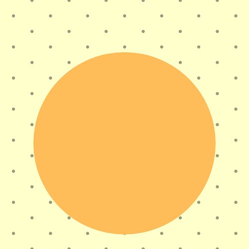

# Steanography
Code to add hidden messages to images. Inspired by my college Image Processing course. Based on the fact that two objects in a 8-bit grayscale image need a minimum 8 gray level difference to be distinuishable to humans.

  

    Original Image
    
  

  

    Modified Image
    
  

  

    Secret Code
    
  

